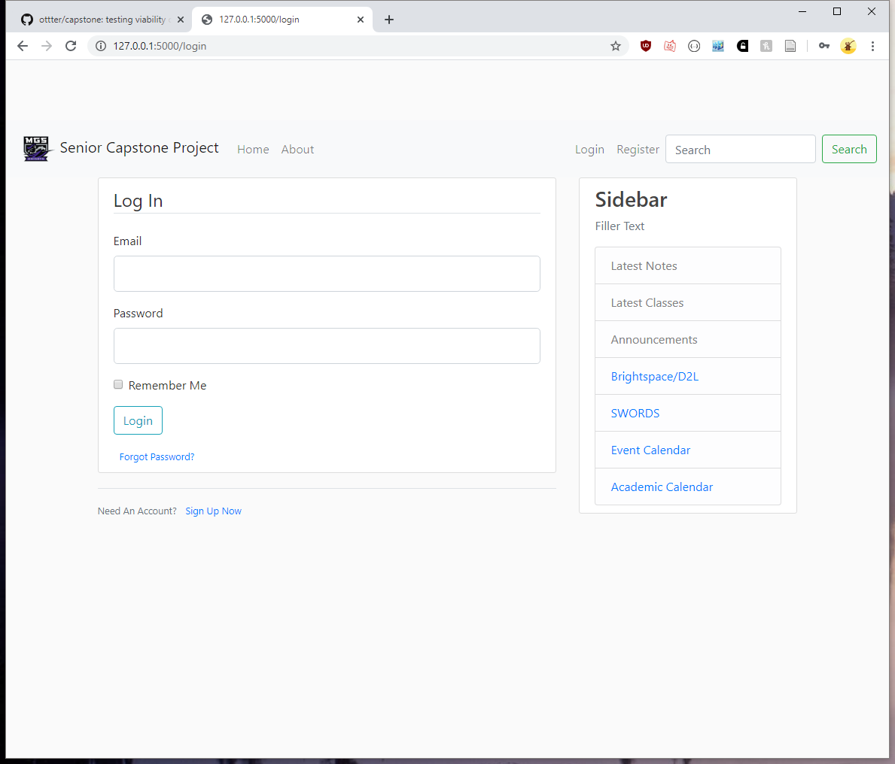
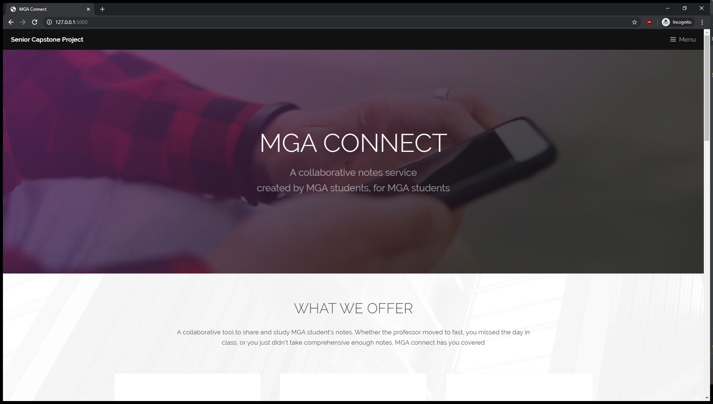
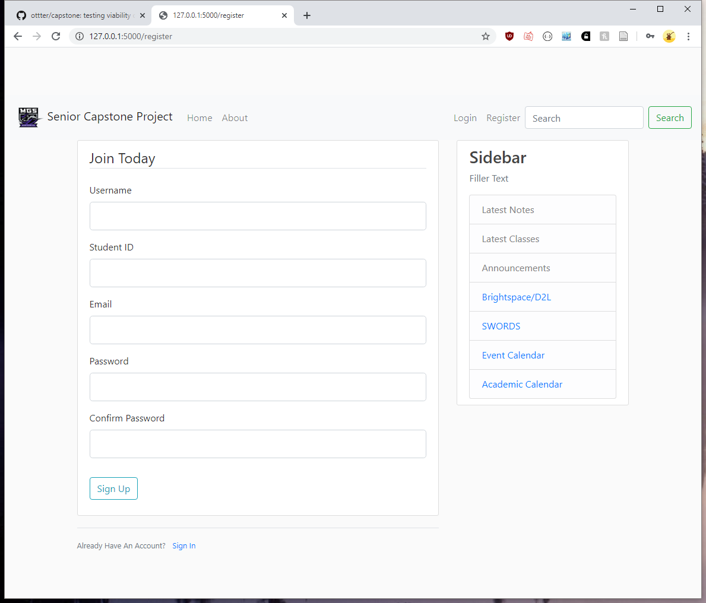
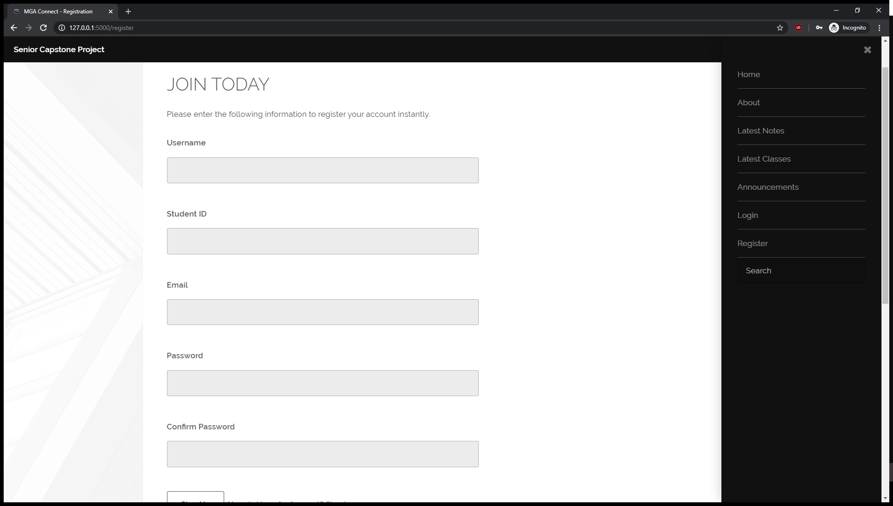
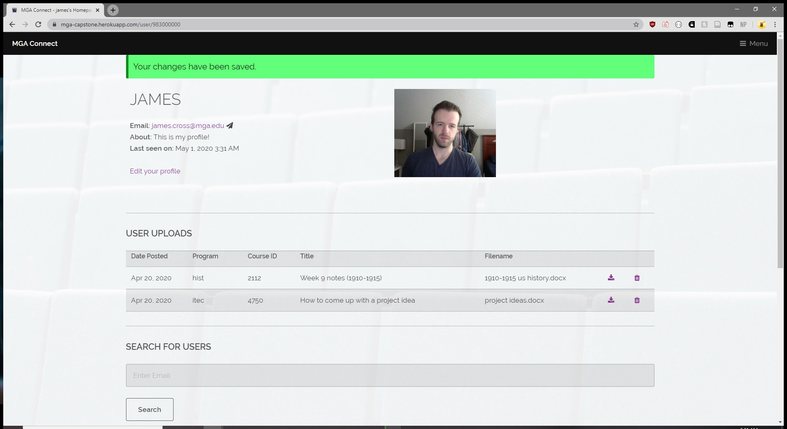
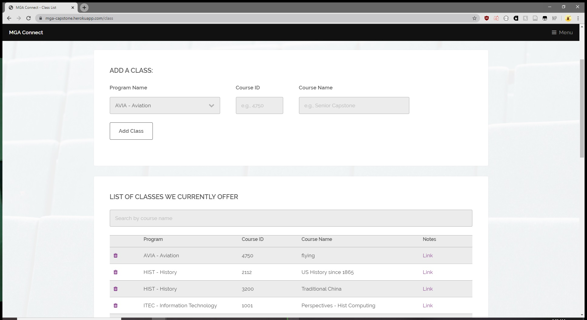

# MGA Senior Capstone
This is the repo for our senior capstone project. The project primarily focuses on the report 
itself while having a functional website with a plan for beyond.

This project utilizes:
* Flask
* Heroku
* Gunicorn
* Bcrypt

## How to run

1. `cd` in to the main directory
2. `pip install -r requirements.txt`
3. (Optional) Change between development and production:  `set FLASK_ENV=development`
4. `flask run`

## Rework

| Original Template (Boostrap)                             | New Template                                         |
|-----------------------------------------------------|------------------------------------------------------|
|    |      |
|  |  |

## Final Version

Example of the user's profile page, including what it looks like to have uploaded content:

Admin view for adding a class:

